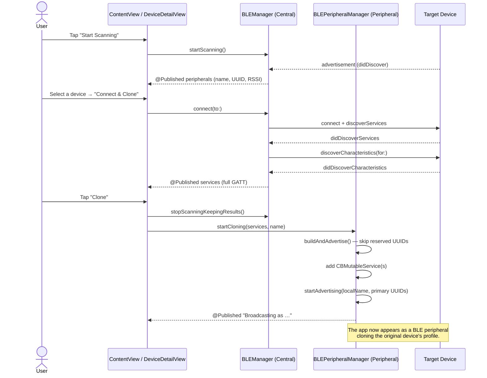

# BLUE — BLE Scanner, GATT Inspector & Device Cloner

A SwiftUI app that scans for nearby **Bluetooth Low Energy (BLE)** devices, connects to one to inspect its full **GATT** profile (services + characteristics), and can then **clone** that profile — re‑broadcasting the same services and characteristics from your own device under the original device's name.

The app plays **both BLE roles** at once:

- 🔍 **Central** (client) — scans, connects, and discovers services/characteristics.
- 📡 **Peripheral** (server) — re‑advertises the discovered profile, impersonating the original device.

Built entirely with **SwiftUI** + **Core Bluetooth**, with no third‑party dependencies.

---

## 🎬 Demo — Working UI

<!--
  ────────────────────────────────────────────────────────────────────────
  ▶️  HOW TO MAKE THE VIDEO PLAY INLINE ON GITHUB  (one‑time, ~30 seconds)
  ────────────────────────────────────────────────────────────────────────
  GitHub will NOT render a video from a file path in the repo. To get an
  inline player you must upload the file to GitHub once and paste the URL
  it generates:

    1. Open this README in GitHub's web editor (click the ✏️ "Edit" pencil),
       OR open a new draft Issue (you don't have to submit it).
    2. Drag-and-drop  docs/ble-demo.mp4  into the text box.
    3. GitHub uploads it and inserts a link that looks like:
         https://github.com/user-attachments/assets/xxxxxxxx-xxxx-xxxx
    4. Copy that URL and paste it ON ITS OWN LINE where the placeholder is
       below (replace the whole placeholder line). Commit. Done — it now
       shows as a video player.
  ────────────────────────────────────────────────────────────────────────
-->

[https://drive.google.com/file/d/1kb1yV5EB9P2ypYYzBF4er-6CDlfTailm/view?usp=sharing]


### Screenshots

| 1 — Scan & inspect GATT | 2 — Clone & broadcast |
|---|---|
| [](https://drive.google.com/file/d/1h829J3N0fY5KmdB0VLJU4zysE-wnntdF/view?usp=sharing) | [](https://drive.google.com/file/d/1Aj6cc4Pas5vqdXQnsvNXfZiE5fYhfxvS/view?usp=sharing) |
| Discovered devices are listed on the left with their **name**, **UUID**, and **signal strength (RSSI)**. Selecting one connects to it and lists every **service** and **characteristic**, including each characteristic's **properties** (Read / Write / Notify…) and inferred **access**. | Tapping **Clone** turns the app into a peripheral that re‑advertises the same services under the same name — note the **green "Broadcasting as …"** banner, the new peripheral **UUID**, and the **Stop** button. |

---

## ✨ Features

- **Live scanning** for all nearby BLE peripherals (no service filter).
- **Real‑time device list** with name, identifier (UUID) and RSSI in dBm; duplicates are de‑duplicated and RSSI refreshes as new advertisements arrive.
- **One‑tap connect** with automatic service & characteristic discovery.
- **Full GATT inspection** — every service and characteristic, with human‑readable property names and derived access (Readable / Writable / Notifiable).
- **GATT cloning** — rebuild the discovered profile as a local peripheral and start advertising it under the original name.
- **iOS‑safe cloning** — automatically **skips reserved/standard service UUIDs** that iOS forbids a peripheral from advertising (Generic Access, Battery, Device Information, etc.).
- **Read/Write backing store** — the cloned peripheral answers central read/write requests from an in‑memory value store.
- **Clear status feedback** — Bluetooth on/off indicator, broadcast banner, and a context‑aware action button.
- Adaptive **`NavigationSplitView`** layout (sidebar + detail) that works on iPad and Mac.

---

## 🧠 How It Works

BLE has two roles. A **Central** scans and connects to peripherals; a **Peripheral** advertises and exposes a GATT database. This app implements **both** so it can read a device's profile and then re‑emit it.



---

## 🗂️ Architecture & File Map

The project is four Swift files, each with a single responsibility:

| File | Role | Responsibility |
|---|---|---|
| **`BLUEApp.swift`** | App entry + main UI | `@main` app, the `ContentView` split‑view (status, device list, scan buttons), and the `Peripheral` model. |
| **`BLEManager.swift`** | **Central** | `CBCentralManager` wrapper — scanning, connecting, and service/characteristic discovery. Publishes scan results and the connected device's GATT. |
| **`BLEPeripheralManager.swift`** | **Peripheral** | `CBPeripheralManager` wrapper — rebuilds the discovered GATT as mutable services and advertises them (the "clone"). Handles incoming read/write/subscribe. |
| **`DeviceDetailView.swift`** | Detail UI + models | The detail pane (device info, services list, action button) plus the `DiscoveredService` and `DiscoveredCharacteristic` models. |

### Data models

```swift
// BLUEApp.swift
struct Peripheral: Identifiable {
    let id: UUID          // CBPeripheral.identifier
    let name: String      // advertised name, or "Unknown"
    let rssi: Int         // signal strength in dBm (more negative = weaker)
}

// DeviceDetailView.swift
struct DiscoveredService: Identifiable {
    let id = UUID()
    let uuid: String
    var isPrimary: Bool = true
    var characteristics: [DiscoveredCharacteristic]
}

struct DiscoveredCharacteristic: Identifiable {
    let id = UUID()
    let uuid: String
    let properties: [String]                 // human-readable: ["Read", "Notify", …]
    let access: [String]                     // inferred: ["Readable", "Writable", …]
    let rawProperties: CBCharacteristicProperties   // kept so the clone can mirror them exactly
}
```

---

## 🔄 Code Flow in Detail

### 1) Central — scan → connect → discover (`BLEManager`)

1. **Init.** `BLEManager()` creates `CBCentralManager(delegate: self, queue: nil)`.
2. **State.** `centralManagerDidUpdateState` sets `@Published isSwitchedOn = (state == .poweredOn)`, which drives the green/red status dot and enables/disables the scan buttons.
3. **Scan.** `startScanning()` calls `scanForPeripherals(withServices: nil)` (discovers everything). `stopScanning()` stops and **clears** the list; `stopScanningKeepingResults()` stops but **keeps** the list (used right before cloning so the results don't vanish).
4. **Discovery.** `centralManager(_:didDiscover:advertisementData:rssi:)` fires once per advertising packet. It builds a `Peripheral`, stores the underlying `CBPeripheral` in a private `discoveredPeripherals[UUID]` map (needed later to connect), and — **on the main thread** — either updates the existing entry (refreshing RSSI) or appends a new one. Doing the "already in list?" check and the mutation together on the main thread prevents the same device being added twice.
5. **Connect.** `connect(to:)` looks up the stored `CBPeripheral`, cancels any previous connection, clears `services`, records `connectedPeripheralUUID`, sets itself as the peripheral's delegate, and calls `connect(...)`.
6. **Service discovery.** `didConnect` → `discoverServices(nil)`. `didDiscoverServices` maps each `CBService` into a `DiscoveredService` (characteristics empty for now), then calls `discoverCharacteristics(nil, for:)` on each.
7. **Characteristic discovery.** `didDiscoverCharacteristicsFor` maps each `CBCharacteristic` into a `DiscoveredCharacteristic`, using two helpers:
   - `describeProperties(_:)` → readable strings like `"Read"`, `"Write Without Response"`, `"Notify"`, `"Indicate"`, `"Signed Write"`, …
   - `deriveAccess(_:)` → infers `"Readable"`, `"Writable"`, `"Notifiable"` from the flags (a central can't see GATT permissions directly, so access is inferred from properties).
   The raw `CBCharacteristicProperties` are retained so the clone can reproduce them. The matching service's `characteristics` array is then filled in on the main thread, and the UI updates live via `@Published services`.
8. **Disconnect / failure.** `didFailToConnect` and `didDisconnectPeripheral` clear `connectedPeripheralUUID` when relevant.

### 2) Peripheral — clone → advertise (`BLEPeripheralManager`)

1. **Start.** `startCloning(services:name:)` stores the pending services and name; if Bluetooth is powered on it calls `buildAndAdvertise()`, otherwise it surfaces a status message (and resumes once `peripheralManagerDidUpdateState` reports `.poweredOn`).
2. **Build.** `buildAndAdvertise()`:
   - Tears down any prior advertising/services.
   - For each discovered service, **skips reserved/standard UUIDs** in `reservedServiceUUIDs` (`1800`, `1801`, `180A`, `180F`, …) because iOS does **not** allow a peripheral app to advertise these.
   - Creates a `CBMutableService` and, for each characteristic, a `CBMutableCharacteristic` that mirrors the original **properties** (read/write/writeWithoutResponse/notify/indicate) and assigns matching **permissions** (`.readable` / `.writeable`).
   - Adds every service via `manager.add(service)`.
   - If nothing is clonable, it reports how many standard services were skipped.
3. **Advertise.** Each `didAdd` callback increments a counter; once **all** services are added, `startAdvertising()` is called with the local name and the **primary** service UUIDs (`CBAdvertisementDataLocalNameKey`, `CBAdvertisementDataServiceUUIDsKey`).
4. **Confirm.** `peripheralManagerDidStartAdvertising` sets `@Published isAdvertising = true` and the status to `Broadcasting as "<name>"`, which renders the green broadcast banner.
5. **Serve requests.** While broadcasting, the peripheral responds to centrals:
   - `didReceiveRead` → returns the value from an in‑memory `valueStore` (or empty `Data`).
   - `didReceiveWrite` → saves written values into `valueStore`.
   - `didSubscribeTo` → updates the status when a central subscribes to notifications.
6. **Stop.** `stop()` stops advertising, removes all services, and clears state.

### 3) UI state machine (the action button in `DeviceDetailView`)

The single toolbar button changes label/behavior based on connection and broadcast state:

| Condition | Button |
|---|---|
| Currently advertising | **Stop** → `advertiser.stop()` |
| Connected **and** services discovered | **Clone** → `stopScanningKeepingResults()` + `startCloning(...)` |
| Connected, services still loading | **Clone** (disabled, spinner) |
| Not connected | **Connect & Clone** (or **Connecting…**) → `connect(to:)` |

`DeviceDetailView` also renders the broadcast banner, the device's name/UUID, a "Discovering services…" progress row, and the grouped list of services/characteristics with their properties and access.

---

## 📁 Project Structure

```
BLE/
├── BLUEApp.swift                 # @main app, ContentView (split view), Peripheral model
├── BLEManager.swift              # Central role: scan / connect / discover
├── BLEPeripheralManager.swift    # Peripheral role: clone / advertise
├── DeviceDetailView.swift        # Detail UI + DiscoveredService / DiscoveredCharacteristic
├── docs/
│   ├── ble-demo.mp4              # Screen recording used in this README
│   ├── inspect-services.png      # Screenshot: scan + GATT inspection
│   └── broadcasting.png          # Screenshot: cloning / broadcasting
└── README.md
```

> ℹ️ The repository contains the four loose Swift source files. To run them, add them to a SwiftUI **App** project in Xcode (the `@main struct BLUEApp` is the entry point) — see below.

---

## 🧰 Requirements

- **Xcode** (recent version) with a Swift 5.9+ toolchain.
- **iOS 17+ / iPadOS 17+ / macOS 14+.** The UI uses `NavigationSplitView`, `LabeledContent`, and the two‑parameter `onChange(of:){ old, new in }`, which require these versions.
- **A physical device for cloning.** The Simulator has no Bluetooth radio and **cannot advertise** as a peripheral. Scanning + cloning need a real iPhone/iPad, or a Mac (the demo was recorded on macOS).
- A **Bluetooth usage description** in `Info.plist` (see Permissions).
- *(Optional but recommended)* a second device or a BLE scanner app (e.g. **nRF Connect** or **LightBlue**) to verify the broadcast.

---

## 🚀 Getting Started

```bash
git clone https://github.com/GEORGIAN86/BLE.git
cd BLE
```

1. In Xcode, create a new **iOS App** (Interface: **SwiftUI**), e.g. named `BLUE`.
2. Delete the template's `ContentView.swift` / `App.swift`, then **add the four files** from this repo to the target:
   `BLUEApp.swift`, `BLEManager.swift`, `BLEPeripheralManager.swift`, `DeviceDetailView.swift`.
3. Add the Bluetooth permission (see below).
4. Select a **real device** as the run destination, build & run, and grant Bluetooth permission when prompted.

### Permissions (Info.plist)

Add a Bluetooth usage string, or iOS will terminate the app on launch:

```xml
<key>NSBluetoothAlwaysUsageDescription</key>
<string>BLUE uses Bluetooth to scan, inspect, and clone nearby BLE devices.</string>
```

*(For older OS targets you may also add `NSBluetoothPeripheralUsageDescription`.)*

---

## 📖 Usage Walkthrough

1. **Launch** the app. The top of the sidebar shows a **green dot / "Bluetooth is ON"** once the radio is ready.
2. Tap **Start Scanning**. Nearby devices populate the list with **name**, **UUID**, and **RSSI (dBm)**.
3. **Select** a device. The detail pane shows its info and begins **discovering services**; once done it lists every service and characteristic with **Properties** and **Access**.
4. If not yet connected, tap **Connect & Clone**. (The list highlights the connected device with a green ✓.)
5. Once services are listed, tap **Clone**. The detail pane shows a green **"Broadcasting as …"** banner and a fresh peripheral **UUID** — your device is now advertising the cloned profile.
6. Tap **Stop** to end the broadcast.

### Verifying the clone

Open **nRF Connect** / **LightBlue** (or another phone) and scan: you should see a peripheral advertising under the cloned **name** and exposing the cloned **service UUIDs** (minus any reserved/standard services iOS doesn't permit).

---

## 🔬 Technical Notes

- **Reserved service UUIDs.** iOS blocks peripheral apps from advertising standard/reserved services (Generic Access `1800`, Generic Attribute `1801`, Device Information `180A`, Battery `180F`, Heart Rate `180D`, etc.). `BLEPeripheralManager.reservedServiceUUIDs` lists these and the cloner skips them, reporting how many were skipped.
- **RSSI is logarithmic.** Values are in **dBm** and are negative; **closer to 0 = stronger** (e.g. `-73 dBm` is stronger than `-98 dBm`).
- **Threading.** All `@Published` mutations that drive the UI are dispatched to the **main thread** inside the Core Bluetooth delegate callbacks.
- **Duplicate handling.** Discoveries are de‑duplicated by `identifier` and updated in place, which avoids both duplicate rows and the noisy "duplicate ID" SwiftUI warning while keeping RSSI fresh.
- **Access vs. permissions.** A central cannot read a characteristic's GATT *permissions*, so the app **infers** access from the advertised *properties*. The original `CBCharacteristicProperties` are preserved so the clone reproduces behavior faithfully.

---

## ⚠️ Limitations & Constraints

- **Profile is cloned, not state.** The clone reproduces the service/characteristic **structure** and properties; it does **not** copy live characteristic *values* — reads return whatever is in the in‑memory `valueStore` (empty until written).
- **iOS advertising limits.** Standard/reserved services are skipped, and iOS limits how much advertising data and how many service UUIDs can be broadcast.
- **No write‑backs to the original.** Writes go to the local store on the clone; they are not forwarded to the original device.
- **Single active connection.** Connecting to a new device cancels the previous connection.
- **Simulator cannot advertise.** Peripheral mode requires real hardware.

---

## 🔐 Responsible Use

This project is intended for **learning, debugging, and security research** on devices you own or are authorized to test (the same use case as tools like nRF Connect's GATT cloning). It does not break encryption or authentication — it only mirrors a device's publicly advertised GATT layout. Impersonating devices can have security and legal implications, so please use it lawfully and ethically.

---

## 🛣️ Possible Improvements

- Capture and replay real characteristic values (read on connect, serve on clone).
- Subscribe to notifications on the original and relay them from the clone.
- Manual read/write UI for individual characteristics.
- Persist scan results and known devices.
- Friendly names for well‑known service/characteristic UUIDs.

---

## 🙌 Credits

Created by **Sumit Awasthi**. Built with SwiftUI and Apple's Core Bluetooth framework.
