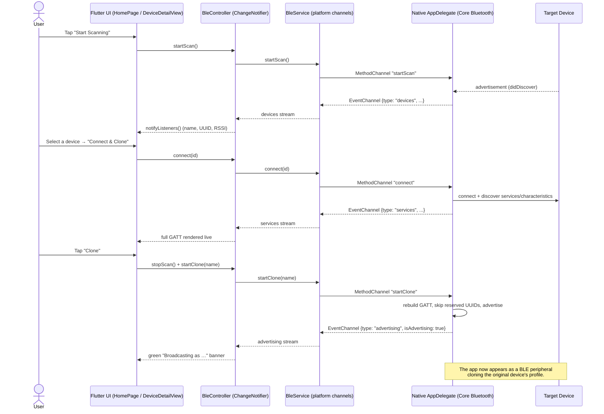

# BLUE — BLE Scanner, GATT Inspector & Device Cloner

A **Flutter** app that scans for nearby **Bluetooth Low Energy (BLE)** devices, connects to one to inspect its full **GATT** profile (services + characteristics), and can then **clone** that profile — re‑broadcasting the same services and characteristics from your own device under the original device's name.

The app plays **both BLE roles** at once:

- 🔍 **Central** (client) — scans, connects, and discovers services/characteristics.
- 📡 **Peripheral** (server) — re‑advertises the discovered profile, impersonating the original device.

The UI and all application state live in **Flutter/Dart**; the BLE radio work is done natively in **Swift + Core Bluetooth** (iOS & macOS) and bridged to Flutter over **platform channels**. This is a Flutter port of the original SwiftUI app — the standalone SwiftUI sources are still included at the repository root for reference (see [Repository layout](#-repository-layout)).

---

## 🎬 Demo — Working UI

[https://drive.google.com/file/d/1kb1yV5EB9P2ypYYzBF4er-6CDlfTailm/view?usp=sharing](https://drive.google.com/file/d/1kb1yV5EB9P2ypYYzBF4er-6CDlfTailm/view?usp=sharing)

### Screenshots

| BLE GATT Scan, Inspection & Clone Broadcast |
|---|
|  |
| The app scans nearby BLE devices and lists their **name**, **UUID**, and **signal strength (RSSI)**. Selecting a device reveals its complete **GATT profile**, including services, characteristics, their **properties** (Read / Write / Notify, etc.), and inferred access. The app can then **clone** the discovered profile and switch into peripheral mode to re-broadcast the same services under the same name, indicated by the **green "Broadcasting as..."** banner with a **Stop** button to end broadcasting. |

---

## ✨ Features

- **Live scanning** for all nearby BLE peripherals (no service filter).
- **Real‑time device list** with name, identifier (UUID) and RSSI in dBm; duplicates are de‑duplicated and RSSI refreshes as new advertisements arrive.
- **One‑tap connect** with automatic service & characteristic discovery.
- **Full GATT inspection** — every service and characteristic, with human‑readable property names and derived access (Readable / Writable / Notifiable).
- **GATT cloning** — rebuild the discovered profile as a local peripheral and start advertising it under the original name.
- **iOS‑safe cloning** — automatically **skips reserved/standard service UUIDs** that iOS forbids a peripheral from advertising (Generic Access, Battery, Device Information, etc.).
- **Read/Write backing store** — the cloned peripheral answers central read/write requests from an in‑memory value store.
- **Clear status feedback** — Bluetooth on/off indicator, broadcast banner, and a context‑aware action button.
- **Adaptive layout** — a sidebar + detail split view on wide screens (tablet/desktop) that collapses to a push‑navigation flow on phones.
- **Cross‑platform** — runs on iOS and macOS from a single Flutter codebase.

---

## 🧠 How It Works

BLE has two roles. A **Central** scans and connects to peripherals; a **Peripheral** advertises and exposes a GATT database. This app implements **both** so it can read a device's profile and then re‑emit it.

Flutter owns the UI and state; the native Swift layer owns Core Bluetooth. They communicate over two platform channels:

- **`MethodChannel("ble/methods")`** — commands flowing **Flutter → native** (`startScan`, `stopScan`, `connect`, `startClone`, `stopClone`).
- **`EventChannel("ble/events")`** — a single multiplexed stream of state updates flowing **native → Flutter**. Each event is a map with a `type` discriminator (`state`, `devices`, `connection`, `services`, `advertising`).

> **Only serializable primitives cross the channel.** Core Bluetooth objects (`CBPeripheral`, `CBService`, `CBCharacteristic`) are never sent to Dart. A characteristic's `CBCharacteristicProperties` option set is transmitted as its **raw integer bitmask**, and the human‑readable property/access lists are derived in Dart. This keeps the native layer thin and makes the property logic unit‑testable.



---

## 🗂️ Architecture

The Dart side is split into four single‑responsibility layers, plus the native bridge:

| Layer | File(s) | Responsibility |
|---|---|---|
| **UI — app & list** | `lib/main.dart` | `BlueApp`, the adaptive `HomePage` split view (status row, device list, scan controls), and the narrow‑screen navigation flow. |
| **UI — detail** | `lib/device_detail_view.dart` | The detail pane: device info, the live services/characteristics list, the broadcast banner, and the context‑aware **Connect / Clone / Stop** action button. |
| **State** | `lib/ble_controller.dart` | `BleController` — a `ChangeNotifier` that subscribes to every `BleService` stream and exposes a single observable snapshot to the UI. |
| **Bridge** | `lib/ble_service.dart` | `BleService` — wraps the method/event channels, sends commands, and **demultiplexes** the incoming event stream into typed Dart streams. |
| **Models** | `lib/models.dart` | `Peripheral`, `DiscoveredService`, `DiscoveredCharacteristic`, `AdvertisingState`, and the `CharacteristicProperty` bit constants. Property/access derivation lives here. |
| **Native** | `ios/Runner/AppDelegate.swift`, `macos/Runner/AppDelegate.swift` | Core Bluetooth **Central** (scan/connect/discover) and **Peripheral** (clone/advertise) managers, wired to the `ble/methods` and `ble/events` channels. |

### Data models (`lib/models.dart`)

```dart
class Peripheral {
  final String id;    // CBPeripheral.identifier as a UUID string
  final String name;  // advertised name or "Unknown"
  final int rssi;     // signal strength in dBm (more negative = weaker)
}

class DiscoveredService {
  final String uuid;
  final bool isPrimary;
  final List<DiscoveredCharacteristic> characteristics;
}

class DiscoveredCharacteristic {
  final String uuid;
  final int rawProperties; // raw CBCharacteristicProperties bitmask
  List<String> get properties; // derived: ["Read", "Notify", …]
  List<String> get access;     // derived: ["Readable", "Writable", …]
}

class AdvertisingState {
  final bool isAdvertising;
  final String statusMessage; // e.g. 'Broadcasting as "…"'
}
```

`CharacteristicProperty` holds the raw `CBCharacteristicProperties` bit values (`read = 0x02`, `write = 0x08`, `notify = 0x10`, …) kept identical to Apple's definitions so the native clone can reconstruct the exact same option set from the integer that round‑trips over the channel.

---

## 🔄 Code Flow in Detail

### 1) Central — scan → connect → discover

1. `BleService` opens the `ble/events` `EventChannel` broadcast stream on construction and demultiplexes every event by its `type` field.
2. A `state` event drives `isBluetoothOn`, which colors the status dot and enables/disables the scan buttons.
3. `startScan()` / `stopScan()` send method calls to native. `stopScan()` also clears the Dart‑side device list immediately for snappy UI.
4. `devices` events arrive as a list of serialized peripherals; `BleService` maps them into `Peripheral` objects (de‑duplicated natively by identifier, with RSSI refreshed in place).
5. `connect(id)` clears stale services in the controller, then sends `connect` to native. Native connects, discovers services and characteristics, and emits a `services` event.
6. Each characteristic arrives as a `uuid` + `rawProperties` integer. The human‑readable `properties` and inferred `access` lists are computed **in Dart** from that bitmask (see `DiscoveredCharacteristic`).

### 2) Peripheral — clone → advertise

1. `startClone(name)` sends the advertised name to native; the native layer already holds the discovered services, so only the name needs to cross the channel.
2. Native rebuilds the discovered profile as mutable Core Bluetooth services/characteristics, **skipping reserved/standard service UUIDs** that iOS forbids a peripheral from advertising (`1800`, `1801`, `180A`, `180F`, …), then starts advertising under the original local name.
3. An `advertising` event (`isAdvertising`, `status`) flows back; the UI shows the green **"Broadcasting as …"** banner.
4. While broadcasting, native serves central read/write requests from an in‑memory value store.
5. `stopClone()` stops advertising and tears down the services.

### 3) UI state machine (the action button)

The single action button in `DeviceDetailView` changes label/behavior based on connection and broadcast state:

| Condition | Button |
|---|---|
| Currently advertising | **Stop** → `controller.stopClone()` |
| Connected **and** services discovered | **Clone** → `stopScan()` + `startClone(name)` |
| Connected, services still loading | spinner (disabled) |
| Not connected | **Connect & Clone** (or **Connecting…**) → `controller.connect(id)` |

---

## 📁 Repository layout

```
ble_app/
├── lib/
│   ├── main.dart                 # BlueApp + adaptive HomePage (sidebar + detail)
│   ├── device_detail_view.dart   # Detail pane + Connect/Clone/Stop action button
│   ├── ble_controller.dart       # ChangeNotifier aggregating BleService streams
│   ├── ble_service.dart          # Platform-channel bridge + event demultiplexing
│   └── models.dart               # Peripheral / DiscoveredService / … + property bits
├── ios/Runner/AppDelegate.swift  # Native Core Bluetooth bridge (iOS)
├── macos/Runner/AppDelegate.swift# Native Core Bluetooth bridge (macOS)
├── test/
│   ├── channel_test.dart         # BleService channel + demux tests
│   ├── models_test.dart          # property/access derivation tests
│   └── widget_test.dart          # UI widget tests
├── pubspec.yaml
└── README.md
│
└── (reference) BLUEApp.swift, BLEManager.swift,
    BLEPeripheralManager.swift, DeviceDetailView.swift
        # The original standalone SwiftUI app this project was ported from.
```

---

## 🧰 Requirements

- **Flutter SDK** with Dart `^3.12.1` (see `pubspec.yaml`).
- **Xcode** with a recent Swift toolchain (for the iOS/macOS native layer and Core Bluetooth).
- **iOS 17+ / iPadOS 17+ / macOS 14+** targets.
- **A physical device for cloning.** The iOS Simulator has no Bluetooth radio and **cannot advertise** as a peripheral. Scanning + cloning need a real iPhone/iPad, or a Mac.
- A **Bluetooth usage description** in `Info.plist` (see [Permissions](#permissions)).
- *(Optional but recommended)* a second device or a BLE scanner app (e.g. **nRF Connect** or **LightBlue**) to verify the broadcast.

---

## 🚀 Getting Started

```bash
git clone https://github.com/GEORGIAN86/BLE.git
cd BLE
flutter pub get
```

Run on a connected device or macOS:

```bash
flutter devices          # list available targets
flutter run -d <device>  # e.g. an attached iPhone, or 'macos'
```

> Build & run on a **real device** for the full scan + clone experience; the Simulator cannot advertise.

### Permissions

Add a Bluetooth usage string, or iOS will terminate the app on launch (`ios/Runner/Info.plist`):

```xml
<key>NSBluetoothAlwaysUsageDescription</key>
<string>BLUE uses Bluetooth to scan, inspect, and clone nearby BLE devices.</string>
```

On macOS, enable the Bluetooth capability in the Runner target's entitlements.

### Running the tests

```bash
flutter test
```

The test suite covers the channel bridge/demultiplexing (`channel_test.dart`), the property/access derivation in the models (`models_test.dart`), and the UI (`widget_test.dart`).

---

## 📖 Usage Walkthrough

1. **Launch** the app. The sidebar shows a **green dot / "Bluetooth is ON"** once the radio is ready.
2. Tap **Start Scanning**. Nearby devices populate the list with **name**, **UUID**, and **RSSI (dBm)**.
3. **Select** a device. The detail pane shows its info and begins **discovering services**; once done it lists every service and characteristic with **Properties** and **Access**.
4. If not yet connected, tap **Connect & Clone**. (The list marks the connected device with a green ✓.)
5. Once services are listed, tap **Clone**. The detail pane shows a green **"Broadcasting as …"** banner — your device is now advertising the cloned profile.
6. Tap **Stop** to end the broadcast.

### Verifying the clone

Open **nRF Connect** / **LightBlue** (or another phone) and scan: you should see a peripheral advertising under the cloned **name** and exposing the cloned **service UUIDs** (minus any reserved/standard services iOS doesn't permit).

---

## 🔬 Technical Notes

- **Reserved service UUIDs.** iOS blocks peripheral apps from advertising standard/reserved services (Generic Access `1800`, Generic Attribute `1801`, Device Information `180A`, Battery `180F`, Heart Rate `180D`, etc.). The native cloner skips these and reports how many were skipped.
- **RSSI is logarithmic.** Values are in **dBm** and are negative; **closer to 0 = stronger** (e.g. `-73 dBm` is stronger than `-98 dBm`).
- **Thin native layer, testable Dart.** Property/access strings are derived in Dart from the raw `CBCharacteristicProperties` bitmask, so that logic is covered by plain unit tests with no Bluetooth hardware.
- **Single multiplexed event stream.** All native → Flutter state flows through one `EventChannel` keyed by a `type` discriminator, keeping the bridge surface small.
- **Access vs. permissions.** A central cannot read a characteristic's GATT *permissions*, so the app **infers** access from the advertised *properties*. The raw properties are preserved so the clone reproduces behavior faithfully.

---

## ⚠️ Limitations & Constraints

- **Profile is cloned, not state.** The clone reproduces the service/characteristic **structure** and properties; it does **not** copy live characteristic *values* — reads return whatever is in the in‑memory value store (empty until written).
- **iOS advertising limits.** Standard/reserved services are skipped, and iOS limits how much advertising data and how many service UUIDs can be broadcast.
- **No write‑backs to the original.** Writes go to the local store on the clone; they are not forwarded to the original device.
- **Single active connection.** Connecting to a new device cancels the previous connection.
- **Simulator cannot advertise.** Peripheral mode requires real hardware.

---

## 🔐 Responsible Use

This project is intended for **learning, debugging, and security research** on devices you own or are authorized to test (the same use case as tools like nRF Connect's GATT cloning). It does not break encryption or authentication — it only mirrors a device's publicly advertised GATT layout. Impersonating devices can have security and legal implications, so please use it lawfully and ethically.

---

## 🛣️ Possible Improvements

- Capture and replay real characteristic values (read on connect, serve on clone).
- Subscribe to notifications on the original and relay them from the clone.
- Manual read/write UI for individual characteristics.
- Persist scan results and known devices.
- Friendly names for well‑known service/characteristic UUIDs.

---

## 🙌 Credits

Created by **Sumit Awasthi**. Built with **Flutter** and Apple's **Core Bluetooth** framework.
